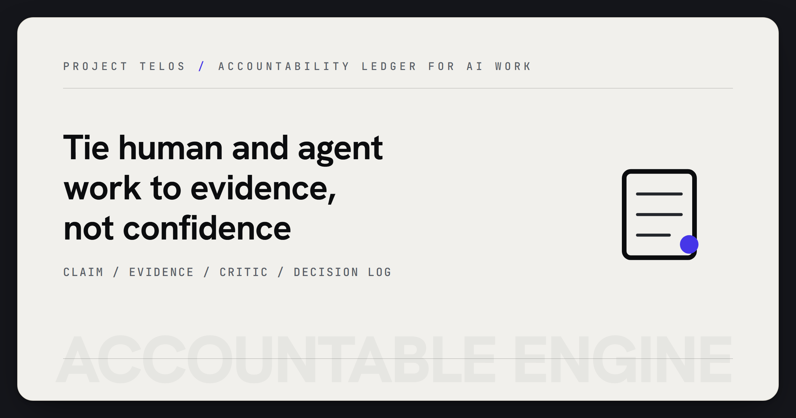

# Accountable Engine



> Keep human and agent work tied to evidence instead of mood, memory, or confidence.

Accountable Engine is a small coordination framework for AI-assisted engineering
work. It gives a repository a claim ledger, a decision log, and a state-aware
critic so people and agents can name the work, attach evidence, and leave a
reviewable trail.

## Why it matters

Large AI-assisted workspaces fail when "done" means "the last message sounded
confident." This repo pushes the workflow toward claims, receipts, and explicit
decisions so a maintainer can resume work without inheriting hidden confidence.

## Try it

```powershell
git clone https://github.com/HarperZ9/accountable-engine.git
cd accountable-engine
powershell -NoProfile -ExecutionPolicy Bypass -File .\critic.ps1
powershell -NoProfile -ExecutionPolicy Bypass -File .\critic.ps1 -For VERIFY -Record "Run tests before claiming done."
```

## What to test first

- Start from `STATE.template.md` and fill one claim with evidence.
- Run `critic.ps1` to review focus, verification, and scope gaps.
- Use `-Record` to append a decision receipt to `DECISIONS.md`.

## Current status

Reference framework plus working PowerShell tooling. The public repo is useful
today as a lightweight accountability pattern; portable CLI packaging is future
work.

## Developer surface

- `STATE.template.md` - coordination protocol and claim ledger shape.
- `critic.ps1` - local reviewer that reads current state and records decisions.
- `USAGE.md` - install, run, record, and boundary guide.
- `.github/workflows/ci.yml` - CI command for the critic.
- `LICENSE` - public release terms.

## What it does

Accountable Engine separates the quality of a work artifact from the confidence
or self-judgment of the person or agent doing the work. Claims of completion must
point at evidence: a build result, a test count, a diff, a receipt, or an explicit
next action.

The same idea scales to multi-agent development. Parallel agents can collide
when they coordinate by chat history alone; a small state file and receipt log
gives the next worker a concrete place to resume.

## Provenance

This repository records the evidence-over-ego accountability pattern and its
operator-facing critic. The git history is the timestamped provenance record.

## License

[MIT](LICENSE)

## For Developers

Keep the public README, examples, and repository metadata aligned with current
behavior. Before opening a PR or publishing a release, verify the working tree
and the documented command:

```powershell
powershell -NoProfile -ExecutionPolicy Bypass -File .\critic.ps1
git status --short
```
